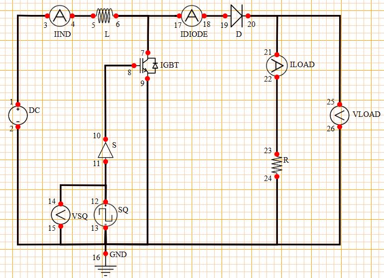

<b>STEP 1:</b> Drag and drop the components in the workspace to create the circuit.  
<b> Nos of required components: </b>  
<b>DC Source - 1, Square Wave – 1, IGBT – 1, Diode - 1</b>  
<b>Inductor - 1, Switch - 1, Ammeter - 3, Resistor - 1</b>  
<b>Voltmeter – 2, Ground – 1</b>  
 
<b>STEP 2:</b> Make the connections as per the instructions given below:  
<b>(a)</b> (01-03, 04-05, 06-07)  
<b>(b)</b> (08-10, 09-13, 11-12)  
<b>(c)</b> (12-14, 15-13, 13-16)  
<b>(d)</b> (13-02, 06-17, 18-19)  
<b>(e)</b> (20-21, 22-23, 24-13)  
<b>(f)</b> (20-25, 26-13)  
<b>Note: Click on the wire to delete the connection.</b>  
<b>STEP 3:</b> Click on the <b>CHECK</b> button to check the connections.
  
<b>Note: Right click on the component to open the dialog box to edit the properties of the component.</b>  
<b>STEP 4:</b> Input the values for all the required components <b>(DC Source, Square Wave, Inductor or Resistor)</b> and the waveform will get plot automatically.  
<b>STEP 5:</b> Now, Click on the <b>ADD</b> button to insert the reading into the observation table.  
<b>STEP 6:</b> Now, you can input different values as per your requirement to get the desired waveform.  
<b>STEP 7:</b> Repeat <b>Step 5</b> to again insert the reading into the table and now repeat <b>Steps 6 to 7</b> to take more readings.  
<b>STEP 8:</b> Click on the <b>PRINT</b> button to take out the print of the webpage.
  
<b>STEP 9:</b> Click on the <b>RESET</b> button to reload the webpage.

